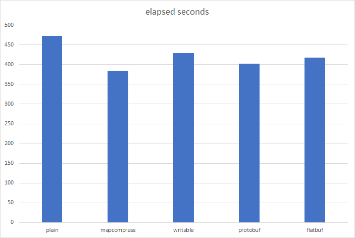
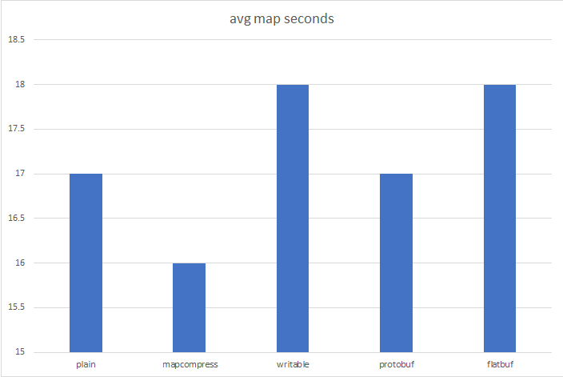
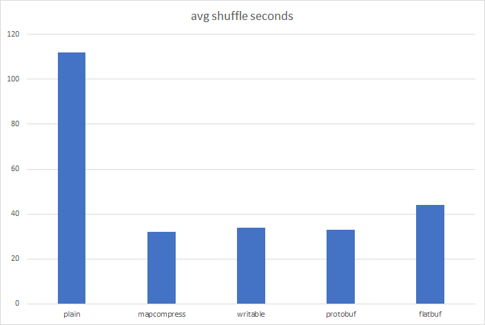
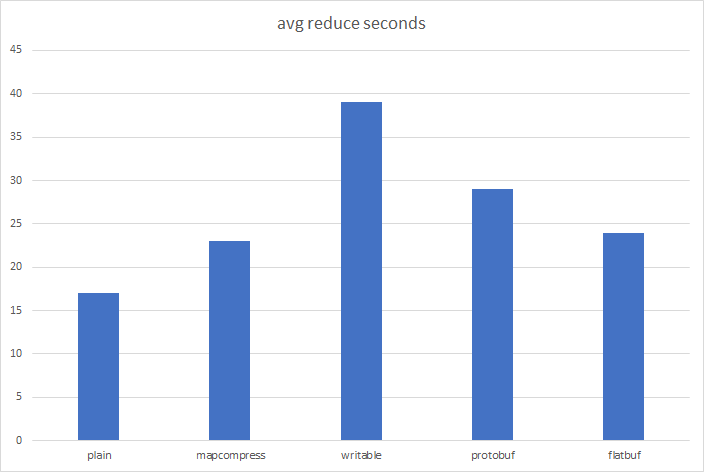
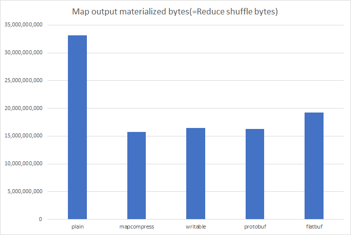
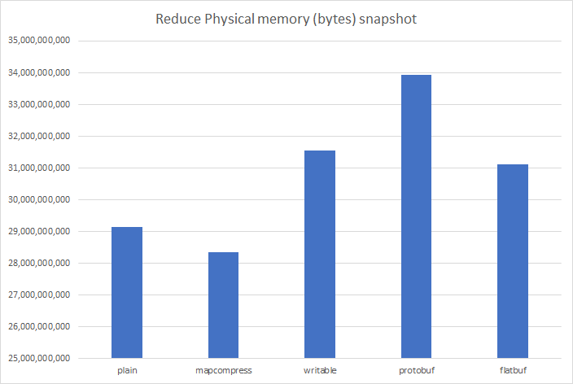
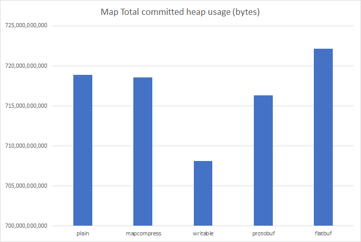
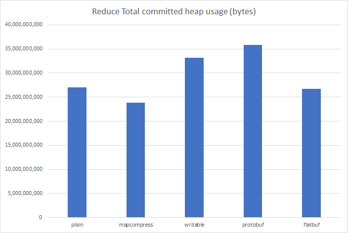

# mr-output

* MR 에선 Mapper 와 Reducer 모두 다른 process 이기에 서로 데이터를 주고받기 위해서는 SerDe(Serialization/Deserialization) 작업이 필수임
  * 어떻게 Serialization 하고 어떻게 Deserialization 할지는 개발자가 정하면 되긴 함
* 개발자는 schema 만 정해주고 library 에서 그 schema 에 맞게 SerDe 를 해주는 것이 google 에서 만든 protocol buffer 임
* 그러나 protocol buffer 는 Deserialization 단계에서 byte[] 를 다시 JavaObject 로 변환하기 때문에 메모리를 많이 소비함
* spark 에서는 scala 와 python 간에 data 변환을 apache arrow 를 이용하여 고속화 했다고 함
* apache arrow 는 왜 빠른지 살펴보니 flat buffer 를 사용한다 함
* google 에서 만든 flat buffer 라는 library 는 태생이 게임엔진에서 빠른 데이터 전송을 위한 library 라고 함
* Deserialization 단계에서 byte[] 를 다시 Object 로 변환하는 작업 없이 byte[] 에서 읽기 때문에 메모리를 적게 쓴다고 함

## flat buffer

```shell
yum install -y cmake
mkdir ~/Downloads
cd ~/Downloads
git clone https://github.com/google/flatbuffers.git
cd flatbuffers/
```

```text
[root@serde:~]# mkdir ~/Downloads
[root@serde:~]# cd ~/Downloads
[root@serde:~/Downloads]# git clone https://github.com/google/flatbuffers.git
Cloning into 'flatbuffers'...
remote: Enumerating objects: 32, done.
remote: Counting objects: 100% (32/32), done.
remote: Compressing objects: 100% (32/32), done.
remote: Total 19649 (delta 7), reused 7 (delta 0), pack-reused 19617
Receiving objects: 100% (19649/19649), 12.06 MiB | 5.32 MiB/s, done.
Resolving deltas: 100% (13659/13659), done.
[root@serde:~/Downloads]# cd flatbuffers/
[root@serde:~/Downloads/flatbuffers]#
```

```shell
cmake -G "Unix Makefiles" -DCMAKE_BUILD_TYPE=Release
```

```text
[root@serde:~/Downloads/flatbuffers]# cmake -G "Unix Makefiles" -DCMAKE_BUILD_TYPE=Release
-- The C compiler identification is GNU 4.8.5
-- The CXX compiler identification is GNU 4.8.5
-- Check for working C compiler: /usr/bin/cc
-- Check for working C compiler: /usr/bin/cc -- works
-- Detecting C compiler ABI info
-- Detecting C compiler ABI info - done
-- Check for working CXX compiler: /usr/bin/c++
-- Check for working CXX compiler: /usr/bin/c++ -- works
-- Detecting CXX compiler ABI info
-- Detecting CXX compiler ABI info - done
-- Looking for strtof_l
-- Looking for strtof_l - found
-- Looking for strtoull_l
-- Looking for strtoull_l - found
-- `tests/monster_test.fbs`: add generation of C++ code with '--no-includes;--gen-compare'
-- `tests/monster_test.fbs`: add generation of binary (.bfbs) schema
-- `tests/namespace_test/namespace_test1.fbs`: add generation of C++ code with '--no-includes;--gen-compare'
-- `tests/namespace_test/namespace_test2.fbs`: add generation of C++ code with '--no-includes;--gen-compare'
-- `tests/union_vector/union_vector.fbs`: add generation of C++ code with '--no-includes;--gen-compare'
-- `tests/optional_scalars.fbs`: add generation of C++ code with '--no-includes;--gen-compare'
-- `tests/native_type_test.fbs`: add generation of C++ code with ''
-- `tests/arrays_test.fbs`: add generation of C++ code with '--scoped-enums;--gen-compare'
-- `tests/arrays_test.fbs`: add generation of binary (.bfbs) schema
-- `tests/monster_test.fbs`: add generation of C++ embedded binary schema code with '--no-includes;--gen-compare'
-- `tests/monster_extra.fbs`: add generation of C++ code with '--no-includes;--gen-compare'
-- `samples/monster.fbs`: add generation of C++ code with '--no-includes;--gen-compare'
-- `samples/monster.fbs`: add generation of binary (.bfbs) schema
-- Proceeding with version: 1.12.0.240
-- Configuring done
-- Generating done
-- Build files have been written to: /root/Downloads/flatbuffers
[root@serde:~/Downloads/flatbuffers]#
```

```shell
make
```

```text
[root@serde:~/Downloads/flatbuffers]# make
Scanning dependencies of target flatbuffers
[  1%] Building CXX object CMakeFiles/flatbuffers.dir/src/idl_parser.cpp.o
[  2%] Building CXX object CMakeFiles/flatbuffers.dir/src/idl_gen_text.cpp.o
[  3%] Building CXX object CMakeFiles/flatbuffers.dir/src/reflection.cpp.o
[  4%] Building CXX object CMakeFiles/flatbuffers.dir/src/util.cpp.o
Linking CXX static library libflatbuffers.a
[  4%] Built target flatbuffers
Scanning dependencies of target flatc
[  6%] Building CXX object CMakeFiles/flatc.dir/src/idl_parser.cpp.o
[  7%] Building CXX object CMakeFiles/flatc.dir/src/idl_gen_text.cpp.o
[  8%] Building CXX object CMakeFiles/flatc.dir/src/reflection.cpp.o
[  9%] Building CXX object CMakeFiles/flatc.dir/src/util.cpp.o
[ 11%] Building CXX object CMakeFiles/flatc.dir/src/idl_gen_cpp.cpp.o
[ 12%] Building CXX object CMakeFiles/flatc.dir/src/idl_gen_csharp.cpp.o
[ 13%] Building CXX object CMakeFiles/flatc.dir/src/idl_gen_dart.cpp.o
[ 14%] Building CXX object CMakeFiles/flatc.dir/src/idl_gen_kotlin.cpp.o
[ 16%] Building CXX object CMakeFiles/flatc.dir/src/idl_gen_go.cpp.o
[ 17%] Building CXX object CMakeFiles/flatc.dir/src/idl_gen_java.cpp.o
[ 18%] Building CXX object CMakeFiles/flatc.dir/src/idl_gen_js_ts.cpp.o
[ 19%] Building CXX object CMakeFiles/flatc.dir/src/idl_gen_php.cpp.o
[ 20%] Building CXX object CMakeFiles/flatc.dir/src/idl_gen_python.cpp.o
[ 22%] Building CXX object CMakeFiles/flatc.dir/src/idl_gen_lobster.cpp.o
[ 23%] Building CXX object CMakeFiles/flatc.dir/src/idl_gen_lua.cpp.o
[ 24%] Building CXX object CMakeFiles/flatc.dir/src/idl_gen_rust.cpp.o
[ 25%] Building CXX object CMakeFiles/flatc.dir/src/idl_gen_fbs.cpp.o
[ 27%] Building CXX object CMakeFiles/flatc.dir/src/idl_gen_grpc.cpp.o
[ 28%] Building CXX object CMakeFiles/flatc.dir/src/idl_gen_json_schema.cpp.o
[ 29%] Building CXX object CMakeFiles/flatc.dir/src/idl_gen_swift.cpp.o
[ 30%] Building CXX object CMakeFiles/flatc.dir/src/flatc.cpp.o
[ 32%] Building CXX object CMakeFiles/flatc.dir/src/flatc_main.cpp.o
[ 33%] Building CXX object CMakeFiles/flatc.dir/src/code_generators.cpp.o
[ 34%] Building CXX object CMakeFiles/flatc.dir/grpc/src/compiler/cpp_generator.cc.o
[ 35%] Building CXX object CMakeFiles/flatc.dir/grpc/src/compiler/go_generator.cc.o
[ 37%] Building CXX object CMakeFiles/flatc.dir/grpc/src/compiler/java_generator.cc.o
[ 38%] Building CXX object CMakeFiles/flatc.dir/grpc/src/compiler/python_generator.cc.o
[ 39%] Building CXX object CMakeFiles/flatc.dir/grpc/src/compiler/swift_generator.cc.o
[ 40%] Building CXX object CMakeFiles/flatc.dir/grpc/src/compiler/ts_generator.cc.o
Linking CXX executable flatc
[ 40%] Built target flatc
Scanning dependencies of target flathash
[ 41%] Building CXX object CMakeFiles/flathash.dir/src/flathash.cpp.o
Linking CXX executable flathash
[ 41%] Built target flathash
Scanning dependencies of target generated_code
[ 43%] Run generation: 'samples/monster.bfbs'
[ 44%] Run generation: 'tests/monster_test_generated.h'
[ 45%] Run generation: 'tests/monster_test.bfbs'
[ 46%] Run generation: 'tests/namespace_test/namespace_test1_generated.h'
[ 48%] Run generation: 'tests/namespace_test/namespace_test2_generated.h'
[ 49%] Run generation: 'tests/union_vector/union_vector_generated.h'
[ 50%] Run generation: 'tests/optional_scalars_generated.h'
[ 51%] Run generation: 'tests/native_type_test_generated.h'
[ 53%] Run generation: 'tests/arrays_test_generated.h'
[ 54%] Run generation: 'tests/arrays_test.bfbs'
[ 55%] Run generation: 'tests/monster_test_bfbs_generated.h'
[ 56%] Run generation: 'tests/monster_extra_generated.h'
[ 58%] Run generation: 'samples/monster_generated.h'
[ 59%] All generated files were updated.
[ 59%] Built target generated_code
Scanning dependencies of target flatsamplebfbs
[ 60%] Building CXX object CMakeFiles/flatsamplebfbs.dir/src/idl_parser.cpp.o
[ 61%] Building CXX object CMakeFiles/flatsamplebfbs.dir/src/idl_gen_text.cpp.o
[ 62%] Building CXX object CMakeFiles/flatsamplebfbs.dir/src/reflection.cpp.o
[ 64%] Building CXX object CMakeFiles/flatsamplebfbs.dir/src/util.cpp.o
[ 65%] Building CXX object CMakeFiles/flatsamplebfbs.dir/samples/sample_bfbs.cpp.o
Linking CXX executable flatsamplebfbs
[ 66%] Built target flatsamplebfbs
Scanning dependencies of target flatsamplebinary
[ 67%] Building CXX object CMakeFiles/flatsamplebinary.dir/samples/sample_binary.cpp.o
Linking CXX executable flatsamplebinary
[ 69%] Built target flatsamplebinary
Scanning dependencies of target flatsampletext
[ 70%] Building CXX object CMakeFiles/flatsampletext.dir/src/idl_parser.cpp.o
[ 71%] Building CXX object CMakeFiles/flatsampletext.dir/src/idl_gen_text.cpp.o
[ 72%] Building CXX object CMakeFiles/flatsampletext.dir/src/reflection.cpp.o
[ 74%] Building CXX object CMakeFiles/flatsampletext.dir/src/util.cpp.o
[ 75%] Building CXX object CMakeFiles/flatsampletext.dir/samples/sample_text.cpp.o
Linking CXX executable flatsampletext
[ 76%] Built target flatsampletext
Scanning dependencies of target flattests
[ 77%] Building CXX object CMakeFiles/flattests.dir/src/idl_parser.cpp.o
[ 79%] Building CXX object CMakeFiles/flattests.dir/src/idl_gen_text.cpp.o
[ 80%] Building CXX object CMakeFiles/flattests.dir/src/reflection.cpp.o
[ 81%] Building CXX object CMakeFiles/flattests.dir/src/util.cpp.o
[ 82%] Building CXX object CMakeFiles/flattests.dir/src/idl_gen_fbs.cpp.o
[ 83%] Building CXX object CMakeFiles/flattests.dir/tests/test.cpp.o
[ 85%] Building CXX object CMakeFiles/flattests.dir/tests/test_assert.cpp.o
[ 86%] Building CXX object CMakeFiles/flattests.dir/tests/test_builder.cpp.o
[ 87%] Building CXX object CMakeFiles/flattests.dir/tests/native_type_test_impl.cpp.o
[ 88%] Building CXX object CMakeFiles/flattests.dir/src/code_generators.cpp.o
Linking CXX executable flattests
[100%] Built target flattests
[root@serde:~/Downloads/flatbuffers]#
```

```shell
make install
```

```text
[root@serde:~/Downloads/flatbuffers]# make install
[  4%] Built target flatbuffers
[ 40%] Built target flatc
[ 41%] Built target flathash
[ 43%] All generated files were updated.
[ 59%] Built target generated_code
[ 66%] Built target flatsamplebfbs
[ 69%] Built target flatsamplebinary
[ 76%] Built target flatsampletext
[100%] Built target flattests
Install the project...
-- Install configuration: "Release"
-- Installing: /usr/local/include/flatbuffers
-- Installing: /usr/local/include/flatbuffers/base.h
-- Installing: /usr/local/include/flatbuffers/code_generators.h
-- Installing: /usr/local/include/flatbuffers/flatbuffers.h
-- Installing: /usr/local/include/flatbuffers/flatc.h
-- Installing: /usr/local/include/flatbuffers/flexbuffers.h
-- Installing: /usr/local/include/flatbuffers/grpc.h
-- Installing: /usr/local/include/flatbuffers/hash.h
-- Installing: /usr/local/include/flatbuffers/idl.h
-- Installing: /usr/local/include/flatbuffers/minireflect.h
-- Installing: /usr/local/include/flatbuffers/pch
-- Installing: /usr/local/include/flatbuffers/pch/flatc_pch.h
-- Installing: /usr/local/include/flatbuffers/pch/pch.h
-- Installing: /usr/local/include/flatbuffers/reflection.h
-- Installing: /usr/local/include/flatbuffers/reflection_generated.h
-- Installing: /usr/local/include/flatbuffers/registry.h
-- Installing: /usr/local/include/flatbuffers/stl_emulation.h
-- Installing: /usr/local/include/flatbuffers/util.h
-- Installing: /usr/local/lib64/cmake/flatbuffers/FlatbuffersConfig.cmake
-- Installing: /usr/local/lib64/cmake/flatbuffers/FlatbuffersConfigVersion.cmake
-- Installing: /usr/local/lib64/libflatbuffers.a
-- Installing: /usr/local/lib64/cmake/flatbuffers/FlatbuffersTargets.cmake
-- Installing: /usr/local/lib64/cmake/flatbuffers/FlatbuffersTargets-release.cmake
-- Installing: /usr/local/bin/flatc
-- Installing: /usr/local/lib64/cmake/flatbuffers/FlatcTargets.cmake
-- Installing: /usr/local/lib64/cmake/flatbuffers/FlatcTargets-release.cmake
[root@serde:~/Downloads/flatbuffers]#
```

```shell
flatc --version
```

```text
[root@serde:~/Downloads/flatbuffers]# flatc --version
flatc version 1.12.0
[root@serde:~/Downloads/flatbuffers]#
```

## protocol buffer

```shell
cd ~/Downloads
wget -c "https://github.com/protocolbuffers/protobuf/releases/download/v2.5.0/protobuf-2.5.0.tar.gz"
tar zxf protobuf-2.5.0.tar.gz
chown -R root:root protobuf-2.5.0
cd protobuf-2.5.0
./autogen.sh
```

```text
[root@serde:~/Downloads/protobuf-2.5.0]# ./autogen.sh
+ sed -i -e 's/RuntimeLibrary="5"/RuntimeLibrary="3"/g;
           s/RuntimeLibrary="4"/RuntimeLibrary="2"/g;' gtest/msvc/gtest_main-md.vcproj gtest/msvc/gtest_main.vcproj gtest/msvc/gtest-md.vcproj gtest/msvc/gtest_prod_test-md.vcproj gtest/msvc/gtest_prod_test.vcproj gtest/msvc/gtest_unittest-md.vcproj gtest/msvc/gtest_unittest.vcproj gtest/msvc/gtest.vcproj
+ autoreconf -f -i -Wall,no-obsolete
libtoolize: putting auxiliary files in AC_CONFIG_AUX_DIR, `build-aux'.
libtoolize: copying file `build-aux/ltmain.sh'
libtoolize: putting macros in AC_CONFIG_MACRO_DIR, `m4'.
libtoolize: copying file `m4/libtool.m4'
libtoolize: copying file `m4/ltoptions.m4'
libtoolize: copying file `m4/ltsugar.m4'
libtoolize: copying file `m4/ltversion.m4'
libtoolize: copying file `m4/lt~obsolete.m4'
parallel-tests: installing 'build-aux/test-driver'
libtoolize: putting auxiliary files in `.'.
libtoolize: copying file `./ltmain.sh'
libtoolize: putting macros in AC_CONFIG_MACRO_DIR, `m4'.
libtoolize: copying file `m4/libtool.m4'
libtoolize: copying file `m4/ltoptions.m4'
libtoolize: copying file `m4/ltsugar.m4'
libtoolize: copying file `m4/ltversion.m4'
libtoolize: copying file `m4/lt~obsolete.m4'
/usr/share/automake-1.13/am/ltlibrary.am: warning: 'libprotobuf-lite.la': linking libtool libraries using a non-POSIX
/usr/share/automake-1.13/am/ltlibrary.am: archiver requires 'AM_PROG_AR' in 'configure.ac'
src/Makefile.am:90:   while processing Libtool library 'libprotobuf-lite.la'
/usr/share/automake-1.13/am/ltlibrary.am: warning: 'libprotobuf.la': linking libtool libraries using a non-POSIX
/usr/share/automake-1.13/am/ltlibrary.am: archiver requires 'AM_PROG_AR' in 'configure.ac'
src/Makefile.am:90:   while processing Libtool library 'libprotobuf.la'
/usr/share/automake-1.13/am/ltlibrary.am: warning: 'libprotoc.la': linking libtool libraries using a non-POSIX
/usr/share/automake-1.13/am/ltlibrary.am: archiver requires 'AM_PROG_AR' in 'configure.ac'
src/Makefile.am:90:   while processing Libtool library 'libprotoc.la'
parallel-tests: installing './test-driver'
+ rm -rf autom4te.cache config.h.in~
+ exit 0
[root@serde:~/Downloads/protobuf-2.5.0]#
```

```shell
./configure
```

```text
[root@serde:~/Downloads/protobuf-2.5.0]# ./configure
checking whether to enable maintainer-specific portions of Makefiles... yes
checking build system type... x86_64-unknown-linux-gnu
checking host system type... x86_64-unknown-linux-gnu
checking target system type... x86_64-unknown-linux-gnu
checking for a BSD-compatible install... /usr/bin/install -c
checking whether build environment is sane... yes
checking for a thread-safe mkdir -p... /usr/bin/mkdir -p
checking for gawk... gawk
checking whether make sets $(MAKE)... yes
checking whether make supports nested variables... yes
...
checking whether -pthread is sufficient with -shared... yes
checking that generated files are newer than configure... done
configure: creating ./config.status
config.status: creating Makefile
config.status: creating scripts/gtest-config
config.status: creating build-aux/config.h
config.status: executing depfiles commands
config.status: executing libtool commands
[root@serde:~/Downloads/protobuf-2.5.0]#
```

```shell
make
```

```text
[root@serde:~/Downloads/protobuf-2.5.0]# make
make  all-recursive
make[1]: Entering directory `/root/Downloads/protobuf-2.5.0'
Making all in .
make[2]: Entering directory `/root/Downloads/protobuf-2.5.0'
make[2]: Leaving directory `/root/Downloads/protobuf-2.5.0'
Making all in src
make[2]: Entering directory `/root/Downloads/protobuf-2.5.0/src'
g++ -DHAVE_CONFIG_H -I. -I..    -pthread -Wall -Wwrite-strings -Woverloaded-virtual -Wno-sign-compare -O2 -g -DNDEBUG -MT main.o -MD -MP -MF .deps/main.Tpo -c -o main.o `test -f 'google/protobuf/compiler/main.cc' || echo './'`google/protobuf/compiler/main.cc
mv -f .deps/main.Tpo .deps/main.Po
/bin/sh ../libtool  --tag=CXX   --mode=compile g++ -DHAVE_CONFIG_H -I. -I..    -pthread -Wall -Wwrite-strings -Woverloaded-virtual -Wno-sign-compare -O2 -g -DNDEBUG -MT atomicops_internals_x86_gcc.lo -MD -MP -MF .deps/atomicops_internals_x86_gcc.Tpo -c -o atomicops_internals_x86_gcc.lo `test -f 'google/protobuf/stubs/atomicops_internals_x86_gcc.cc' || echo './'`google/protobuf/stubs/atomicops_internals_x86_gcc.cc
libtool: compile:  g++ -DHAVE_CONFIG_H -I. -I.. -pthread -Wall -Wwrite-strings -Woverloaded-virtual -Wno-sign-compare -O2 -g -DNDEBUG -MT atomicops_internals_x86_gcc.lo -MD -MP -MF .deps/atomicops_internals_x86_gcc.Tpo -c google/protobuf/stubs/atomicops_internals_x86_gcc.cc  -fPIC -DPIC -o .libs/atomicops_internals_x86_gcc.o
libtool: compile:  g++ -DHAVE_CONFIG_H -I. -I.. -pthread -Wall -Wwrite-strings -Woverloaded-virtual -Wno-sign-compare -O2 -g -DNDEBUG -MT atomicops_internals_x86_gcc.lo -MD -MP -MF .deps/atomicops_internals_x86_gcc.Tpo -c google/protobuf/stubs/atomicops_internals_x86_gcc.cc -o atomicops_internals_x86_gcc.o >/dev/null 2>&1
...
make  all-am
make[3]: Entering directory `/root/Downloads/protobuf-2.5.0/src'
/bin/sh ../libtool  --tag=CXX   --mode=link g++ -pthread -Wall -Wwrite-strings -Woverloaded-virtual -Wno-sign-compare -O2 -g -DNDEBUG -version-info 8:0:0 -export-dynamic -no-undefined  -o libprotobuf-lite.la -rpath /usr/local/lib atomicops_internals_x86_gcc.lo atomicops_internals_x86_msvc.lo common.lo once.lo stringprintf.lo extension_set.lo generated_message_util.lo message_lite.lo repeated_field.lo wire_format_lite.lo coded_stream.lo zero_copy_stream.lo zero_copy_stream_impl_lite.lo -lpthread
libtool: link: g++  -fPIC -DPIC -shared -nostdlib /usr/lib/gcc/x86_64-redhat-linux/4.8.5/../../../../lib64/crti.o /usr/lib/gcc/x86_64-redhat-linux/4.8.5/crtbeginS.o  .libs/atomicops_internals_x86_gcc.o .libs/atomicops_internals_x86_msvc.o .libs/common.o .libs/once.o .libs/stringprintf.o .libs/extension_set.o .libs/generated_message_util.o .libs/message_lite.o .libs/repeated_field.o .libs/wire_format_lite.o .libs/coded_stream.o .libs/zero_copy_stream.o .libs/zero_copy_stream_impl_lite.o   -lpthread -L/usr/lib/gcc/x86_64-redhat-linux/4.8.5 -L/usr/lib/gcc/x86_64-redhat-linux/4.8.5/../../../../lib64 -L/lib/../lib64 -L/usr/lib/../lib64 -L/usr/lib/gcc/x86_64-redhat-linux/4.8.5/../../.. -lstdc++ -lm -lc -lgcc_s /usr/lib/gcc/x86_64-redhat-linux/4.8.5/crtendS.o /usr/lib/gcc/x86_64-redhat-linux/4.8.5/../../../../lib64/crtn.o  -pthread -O2   -pthread -Wl,-soname -Wl,libprotobuf-lite.so.8 -o .libs/libprotobuf-lite.so.8.0.0
libtool: link: (cd ".libs" && rm -f "libprotobuf-lite.so.8" && ln -s "libprotobuf-lite.so.8.0.0" "libprotobuf-lite.so.8")
libtool: link: (cd ".libs" && rm -f "libprotobuf-lite.so" && ln -s "libprotobuf-lite.so.8.0.0" "libprotobuf-lite.so")
libtool: link: ar cru .libs/libprotobuf-lite.a  atomicops_internals_x86_gcc.o atomicops_internals_x86_msvc.o common.o once.o stringprintf.o extension_set.o generated_message_util.o message_lite.o repeated_field.o wire_format_lite.o coded_stream.o zero_copy_stream.o zero_copy_stream_impl_lite.o
libtool: link: ranlib .libs/libprotobuf-lite.a
libtool: link: ( cd ".libs" && rm -f "libprotobuf-lite.la" && ln -s "../libprotobuf-lite.la" "libprotobuf-lite.la" )
make[3]: Leaving directory `/root/Downloads/protobuf-2.5.0/src'
make[2]: Leaving directory `/root/Downloads/protobuf-2.5.0/src'
make[1]: Leaving directory `/root/Downloads/protobuf-2.5.0'
[root@serde:~/Downloads/protobuf-2.5.0]#
```

```shell
make install
```

```text
[root@serde:~/Downloads/protobuf-2.5.0]# make install
Making install in .
make[1]: Entering directory `/root/Downloads/protobuf-2.5.0'
make[2]: Entering directory `/root/Downloads/protobuf-2.5.0'
make[2]: Nothing to be done for `install-exec-am'.
/usr/bin/mkdir -p '/usr/local/lib/pkgconfig'
/usr/bin/install -c -m 644 protobuf.pc protobuf-lite.pc '/usr/local/lib/pkgconfig'
make[2]: Leaving directory `/root/Downloads/protobuf-2.5.0'
make[1]: Leaving directory `/root/Downloads/protobuf-2.5.0'
Making install in src
make[1]: Entering directory `/root/Downloads/protobuf-2.5.0/src'
make  install-am
make[2]: Entering directory `/root/Downloads/protobuf-2.5.0/src'
make[3]: Entering directory `/root/Downloads/protobuf-2.5.0/src'
/usr/bin/mkdir -p '/usr/local/lib'
/bin/sh ../libtool   --mode=install /usr/bin/install -c   libprotobuf-lite.la libprotobuf.la libprotoc.la '/usr/local/lib'
libtool: install: /usr/bin/install -c .libs/libprotobuf-lite.so.8.0.0 /usr/local/lib/libprotobuf-lite.so.8.0.0
libtool: install: (cd /usr/local/lib && { ln -s -f libprotobuf-lite.so.8.0.0 libprotobuf-lite.so.8 || { rm -f libprotobuf-lite.so.8 && ln -s libprotobuf-lite.so.8.0.0 libprotobuf-lite.so.8; }; })
libtool: install: (cd /usr/local/lib && { ln -s -f libprotobuf-lite.so.8.0.0 libprotobuf-lite.so || { rm -f libprotobuf-lite.so && ln -s libprotobuf-lite.so.8.0.0 libprotobuf-lite.so; }; })
libtool: install: /usr/bin/install -c .libs/libprotobuf-lite.lai /usr/local/lib/libprotobuf-lite.la
libtool: install: /usr/bin/install -c .libs/libprotobuf.so.8.0.0 /usr/local/lib/libprotobuf.so.8.0.0
libtool: install: (cd /usr/local/lib && { ln -s -f libprotobuf.so.8.0.0 libprotobuf.so.8 || { rm -f libprotobuf.so.8 && ln -s libprotobuf.so.8.0.0 libprotobuf.so.8; }; })
libtool: install: (cd /usr/local/lib && { ln -s -f libprotobuf.so.8.0.0 libprotobuf.so || { rm -f libprotobuf.so && ln -s libprotobuf.so.8.0.0 libprotobuf.so; }; })
libtool: install: /usr/bin/install -c .libs/libprotobuf.lai /usr/local/lib/libprotobuf.la
libtool: install: warning: relinking `libprotoc.la'
libtool: install: (cd /root/Downloads/protobuf-2.5.0/src; /bin/sh /root/Downloads/protobuf-2.5.0/libtool  --tag CXX --mode=relink g++ -pthread -Wall -Wwrite-strings -Woverloaded-virtual -Wno-sign-compare -O2 -g -DNDEBUG -version-info 8:0:0 -export-dynamic -no-undefined -o libprotoc.la -rpath /usr/local/lib code_generator.lo command_line_interface.lo plugin.lo plugin.pb.lo subprocess.lo zip_writer.lo cpp_enum.lo cpp_enum_field.lo cpp_extension.lo cpp_field.lo cpp_file.lo cpp_generator.lo cpp_helpers.lo cpp_message.lo cpp_message_field.lo cpp_primitive_field.lo cpp_service.lo cpp_string_field.lo java_enum.lo java_enum_field.lo java_extension.lo java_field.lo java_file.lo java_generator.lo java_helpers.lo java_message.lo java_message_field.lo java_primitive_field.lo java_service.lo java_string_field.lo java_doc_comment.lo python_generator.lo -lpthread libprotobuf.la )
libtool: relink: g++  -fPIC -DPIC -shared -nostdlib /usr/lib/gcc/x86_64-redhat-linux/4.8.5/../../../../lib64/crti.o /usr/lib/gcc/x86_64-redhat-linux/4.8.5/crtbeginS.o  .libs/code_generator.o .libs/command_line_interface.o .libs/plugin.o .libs/plugin.pb.o .libs/subprocess.o .libs/zip_writer.o .libs/cpp_enum.o .libs/cpp_enum_field.o .libs/cpp_extension.o .libs/cpp_field.o .libs/cpp_file.o .libs/cpp_generator.o .libs/cpp_helpers.o .libs/cpp_message.o .libs/cpp_message_field.o .libs/cpp_primitive_field.o .libs/cpp_service.o .libs/cpp_string_field.o .libs/java_enum.o .libs/java_enum_field.o .libs/java_extension.o .libs/java_field.o .libs/java_file.o .libs/java_generator.o .libs/java_helpers.o .libs/java_message.o .libs/java_message_field.o .libs/java_primitive_field.o .libs/java_service.o .libs/java_string_field.o .libs/java_doc_comment.o .libs/python_generator.o   -Wl,-rpath -Wl,/usr/local/lib -L/usr/local/lib -lprotobuf -lpthread -L/usr/lib/gcc/x86_64-redhat-linux/4.8.5 -L/usr/lib/gcc/x86_64-redhat-linux/4.8.5/../../../../lib64 -L/lib/../lib64 -L/usr/lib/../lib64 -L/usr/lib/gcc/x86_64-redhat-linux/4.8.5/../../.. -lstdc++ -lm -lc -lgcc_s /usr/lib/gcc/x86_64-redhat-linux/4.8.5/crtendS.o /usr/lib/gcc/x86_64-redhat-linux/4.8.5/../../../../lib64/crtn.o  -pthread -O2   -pthread -Wl,-soname -Wl,libprotoc.so.8 -o .libs/libprotoc.so.8.0.0
libtool: install: /usr/bin/install -c .libs/libprotoc.so.8.0.0T /usr/local/lib/libprotoc.so.8.0.0
libtool: install: (cd /usr/local/lib && { ln -s -f libprotoc.so.8.0.0 libprotoc.so.8 || { rm -f libprotoc.so.8 && ln -s libprotoc.so.8.0.0 libprotoc.so.8; }; })
libtool: install: (cd /usr/local/lib && { ln -s -f libprotoc.so.8.0.0 libprotoc.so || { rm -f libprotoc.so && ln -s libprotoc.so.8.0.0 libprotoc.so; }; })
libtool: install: /usr/bin/install -c .libs/libprotoc.lai /usr/local/lib/libprotoc.la
libtool: install: /usr/bin/install -c .libs/libprotobuf-lite.a /usr/local/lib/libprotobuf-lite.a
libtool: install: chmod 644 /usr/local/lib/libprotobuf-lite.a
libtool: install: ranlib /usr/local/lib/libprotobuf-lite.a
libtool: install: /usr/bin/install -c .libs/libprotobuf.a /usr/local/lib/libprotobuf.a
libtool: install: chmod 644 /usr/local/lib/libprotobuf.a
libtool: install: ranlib /usr/local/lib/libprotobuf.a
libtool: install: /usr/bin/install -c .libs/libprotoc.a /usr/local/lib/libprotoc.a
libtool: install: chmod 644 /usr/local/lib/libprotoc.a
libtool: install: ranlib /usr/local/lib/libprotoc.a
libtool: finish: PATH="/usr/local/java/default/bin:/usr/local/maven/default/bin:/usr/local/scala/default/bin:/usr/local/sbin:/usr/local/bin:/usr/sbin:/usr/bin:/root/bin:/sbin" ldconfig -n /usr/local/lib
----------------------------------------------------------------------
Libraries have been installed in:
/usr/local/lib

If you ever happen to want to link against installed libraries
in a given directory, LIBDIR, you must either use libtool, and
specify the full pathname of the library, or use the `-LLIBDIR'
flag during linking and do at least one of the following:
- add LIBDIR to the `LD_LIBRARY_PATH' environment variable
  during execution
- add LIBDIR to the `LD_RUN_PATH' environment variable
  during linking
- use the `-Wl,-rpath -Wl,LIBDIR' linker flag
- have your system administrator add LIBDIR to `/etc/ld.so.conf'

See any operating system documentation about shared libraries for
more information, such as the ld(1) and ld.so(8) manual pages.
----------------------------------------------------------------------
/usr/bin/mkdir -p '/usr/local/bin'
/bin/sh ../libtool   --mode=install /usr/bin/install -c protoc '/usr/local/bin'
libtool: install: /usr/bin/install -c .libs/protoc /usr/local/bin/protoc
/usr/bin/mkdir -p '/usr/local/include'
/usr/bin/mkdir -p '/usr/local/include/google/protobuf'
/usr/bin/install -c -m 644  google/protobuf/descriptor.proto '/usr/local/include/google/protobuf'
/usr/bin/mkdir -p '/usr/local/include/google/protobuf/compiler'
/usr/bin/install -c -m 644  google/protobuf/compiler/plugin.proto '/usr/local/include/google/protobuf/compiler'
/usr/bin/mkdir -p '/usr/local/include'
/usr/bin/mkdir -p '/usr/local/include/google/protobuf/compiler/java'
/usr/bin/install -c -m 644  google/protobuf/compiler/java/java_generator.h '/usr/local/include/google/protobuf/compiler/java'
/usr/bin/mkdir -p '/usr/local/include/google/protobuf/compiler/cpp'
/usr/bin/install -c -m 644  google/protobuf/compiler/cpp/cpp_generator.h '/usr/local/include/google/protobuf/compiler/cpp'
/usr/bin/mkdir -p '/usr/local/include/google/protobuf/compiler/python'
/usr/bin/install -c -m 644  google/protobuf/compiler/python/python_generator.h '/usr/local/include/google/protobuf/compiler/python'
/usr/bin/mkdir -p '/usr/local/include/google/protobuf'
/usr/bin/install -c -m 644  google/protobuf/descriptor.h google/protobuf/descriptor.pb.h google/protobuf/descriptor_database.h google/protobuf/dynamic_message.h google/protobuf/extension_set.h google/protobuf/generated_enum_reflection.h google/protobuf/generated_message_util.h google/protobuf/generated_message_reflection.h google/protobuf/message.h google/protobuf/message_lite.h google/protobuf/reflection_ops.h google/protobuf/repeated_field.h google/protobuf/service.h google/protobuf/text_format.h google/protobuf/unknown_field_set.h google/protobuf/wire_format.h google/protobuf/wire_format_lite.h google/protobuf/wire_format_lite_inl.h '/usr/local/include/google/protobuf'
/usr/bin/mkdir -p '/usr/local/include/google/protobuf/stubs'
/usr/bin/install -c -m 644  google/protobuf/stubs/atomicops.h google/protobuf/stubs/atomicops_internals_arm_gcc.h google/protobuf/stubs/atomicops_internals_arm_qnx.h google/protobuf/stubs/atomicops_internals_atomicword_compat.h google/protobuf/stubs/atomicops_internals_macosx.h google/protobuf/stubs/atomicops_internals_mips_gcc.h google/protobuf/stubs/atomicops_internals_pnacl.h google/protobuf/stubs/atomicops_internals_x86_gcc.h google/protobuf/stubs/atomicops_internals_x86_msvc.h google/protobuf/stubs/common.h google/protobuf/stubs/platform_macros.h google/protobuf/stubs/once.h google/protobuf/stubs/template_util.h google/protobuf/stubs/type_traits.h '/usr/local/include/google/protobuf/stubs'
/usr/bin/mkdir -p '/usr/local/include/google/protobuf/compiler'
/usr/bin/install -c -m 644  google/protobuf/compiler/code_generator.h google/protobuf/compiler/command_line_interface.h google/protobuf/compiler/importer.h google/protobuf/compiler/parser.h google/protobuf/compiler/plugin.h google/protobuf/compiler/plugin.pb.h '/usr/local/include/google/protobuf/compiler'
/usr/bin/mkdir -p '/usr/local/include/google/protobuf/io'
/usr/bin/install -c -m 644  google/protobuf/io/coded_stream.h google/protobuf/io/printer.h google/protobuf/io/tokenizer.h google/protobuf/io/zero_copy_stream.h google/protobuf/io/zero_copy_stream_impl.h google/protobuf/io/zero_copy_stream_impl_lite.h '/usr/local/include/google/protobuf/io'
make[3]: Leaving directory `/root/Downloads/protobuf-2.5.0/src'
make[2]: Leaving directory `/root/Downloads/protobuf-2.5.0/src'
make[1]: Leaving directory `/root/Downloads/protobuf-2.5.0/src'
[root@serde:~/Downloads/protobuf-2.5.0]#
```

```shell
protoc --version
```

```text
[root@serde:~/Downloads/protobuf-2.5.0]# protoc --version
libprotoc 2.5.0
[root@serde:~/Downloads/protobuf-2.5.0]#
```

## data download

```shell
cd ~/Downloads
for i in {01..12} ; do wget -c "https://s3.amazonaws.com/nyc-tlc/trip+data/yellow_tripdata_2018-${i}.csv" ; done
for i in {01..12} ; do wget -c "https://s3.amazonaws.com/nyc-tlc/trip+data/yellow_tripdata_2019-${i}.csv" ; done
for i in {01..06} ; do wget -c "https://s3.amazonaws.com/nyc-tlc/trip+data/yellow_tripdata_2020-${i}.csv" ; done
hdfs dfs -mkdir -p /data/trip
hdfs dfs -put yellow_tripdata_20* /data/trip
```

schema 는 [여기](https://www1.nyc.gov/assets/tlc/downloads/pdf/data_dictionary_trip_records_yellow.pdf)

## MR 실행

input data 는 yellow_tripdata 2017-01 ~ 2020-06 총 26.5 G

```shell
yarn jar mr-output-1.0-SNAPSHOT.jar com.tistory.hskimsky.mapreduce.MapReduceDriver plain       /data/trip /data/trip_plain       25 5120 2048 0.9
yarn jar mr-output-1.0-SNAPSHOT.jar com.tistory.hskimsky.mapreduce.MapReduceDriver mapcompress /data/trip /data/trip_mapcompress 25 5120 2048 0.9
yarn jar mr-output-1.0-SNAPSHOT.jar com.tistory.hskimsky.mapreduce.MapReduceDriver writable    /data/trip /data/trip_writable    25 5120 2048 0.9
yarn jar mr-output-1.0-SNAPSHOT.jar com.tistory.hskimsky.mapreduce.MapReduceDriver protobuf    /data/trip /data/trip_protobuf    25 5120 2048 0.9
yarn jar mr-output-1.0-SNAPSHOT.jar com.tistory.hskimsky.mapreduce.MapReduceDriver flatbuf     /data/trip /data/trip_flatbuf     25 5120 2048 0.9
```

## Counter screenshot




















## 결론

데이터 사이즈가 크지 않고(26.5 GB) reducer 가 25개 뿐이었고 용량이 더 커진다면 결과는 달라질 수 있다

* map output 이 protocol buffer 에 비해서 높기 때문에 reducer 단계에서 shuffle 이 많았음
* 하지만 reduce 시간은 줄어들었음
* reducer 단계에서 사용하는 memory 도 줄어들었음
* schema file 로부터 생성되는 java file 크기도 1/8 정도로 줄어들었음
  * 78100 -> 9197
